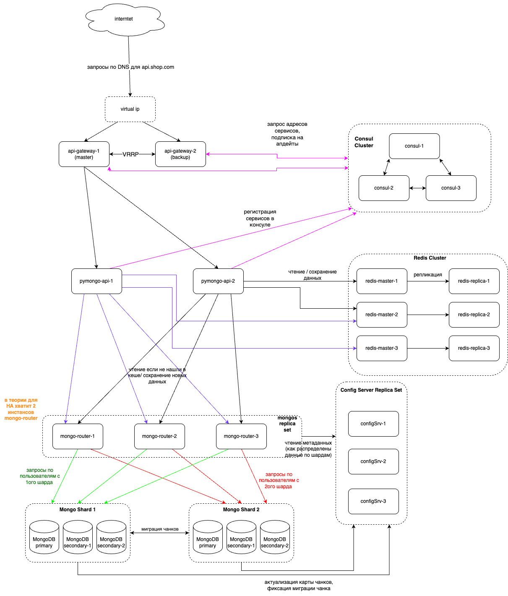

## Задание 5

На схеме я добавил Consul в качестве service-registry. У консула 3 инстанса для обеспечения HA и возможности выбора лидера.

Также я добавил 2 инстанса api-gateway для отказоустойчивости. Api-Gateway используют VRRP для работы в режиме active-stand by . Домен сервиса api.shop.com привязан к виртуальному ip адресу, поэтому маршрутизация идет на  мастер-узел api-gateway. В случае падения мастера, запросы будут перенаправлены на stand by узел.

### Схема решения

